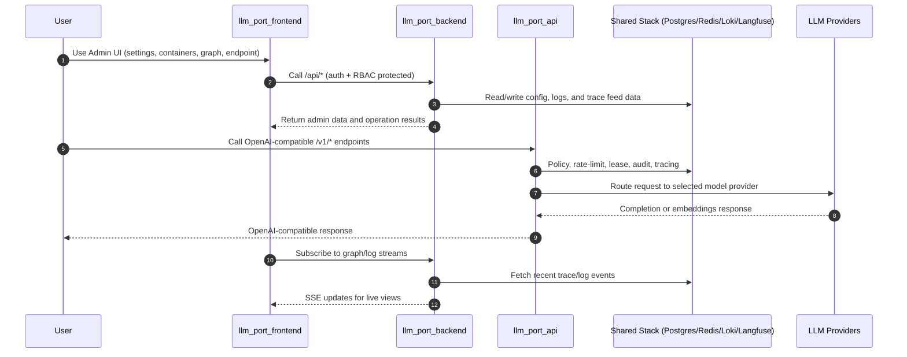

# llM.Port Frontend

This is the React-based admin console for llm.port, providing a unified UI to manage containers and LLM infrastructure, configure system settings and initialization workflows, monitor logs/traces, and operate the centralized OpenAI-compatible gateway through backend APIs.

## Getting Started

### Installation

Install the dependencies:

```bash
npm install
```

### Development

Start the development server with HMR:

```bash
npm run dev
```

Your application will be available at `http://localhost:5173`.

If your backend runs on another host, set the API proxy target before starting dev server:

```bash
# PowerShell
$env:VITE_API_PROXY_TARGET="http://192.168.1.6:8000"
npm run dev
```

For chat-only API override at build/runtime config time, set:

```bash
VITE_CHAT_API_BASE=http://192.168.1.6:8000/api/chat
```

Or set a shared API base for all API modules that support it:

```bash
VITE_API_BASE=http://192.168.1.6:8000/api
```

Use one of these when `/api/chat/*` is not reverse-proxied on the frontend origin.

## Building for Production

Create a production build:

```bash
npm run build
```

## Deployment

### Docker Deployment

To build and run using Docker:

```bash
docker build -t my-app .

# Run the container
docker run -p 3000:3000 my-app
```

### DIY Deployment

If you're familiar with deploying Node applications, the built-in app server is production-ready.

Make sure to deploy the output of `npm run build`

```
├── package.json
├── package-lock.json (or pnpm-lock.yaml, or bun.lockb)
├── build/
│   ├── client/    # Static assets
│   └── server/    # Server-side code
```

## Admin Logs Page

- Primary route: `/admin/logs`
- Tabs:
  - `Logs` (Loki query + live tail through backend `/api/logs/*`)
  - `Audit` (existing audit log table)
- Legacy route `/admin/audit` now redirects to `/admin/logs?tab=audit`.

## Runtime i18n

- Frontend uses `react-i18next` with HTTP backend.
- Bundles are loaded from:
  - `/api/i18n/languages`
  - `/api/i18n/{lang}/{namespace}`
- Language selection is available in the admin top bar and persisted in `localStorage` (`llm-port-lang`).
- New languages can be added on backend bundle files without rebuilding frontend assets.

## LLM Graph Visualizer

- New route: `/admin/llm/graph`
- Built with `reactflow` and rendered as read-only topology + live traces view.
- Data source is backend-only:
  - `GET /api/llm/graph/topology`
  - `GET /api/llm/graph/traces`
  - `GET /api/llm/graph/traces/stream` (SSE)
- Frontend never calls Langfuse directly and does not contain Langfuse credentials.

## Frontend System Overview



## LLM Endpoint Admin Page

- Route: `/admin/llm/endpoint`
- Embeds `llm_port_api` Swagger UI and includes container lifecycle controls (`Start`, `Stop`, `Restart`).
- Uses backend container admin APIs only (no direct Docker access from browser).

## System Settings + Wizard

- Route: `/admin/settings?tab=general`
  - Backend schema-driven settings rendering (`/api/admin/system/settings/*`)
  - Searchable/grouped fields with apply-scope badges.
- Route: `/admin/settings?tab=system-init`
  - Step-based system initialization wizard (`/api/admin/system/wizard/*`)
  - Uses the same backend settings update/apply path as General settings.

## Breaking Rename Migration (`llm-port` -> `llm-port`)

- Frontend branding is now `llm-port`.
- Local storage keys changed:
  - `llm-port-lang` -> `llm-port-lang`
  - `llm-port-theme-mode` -> `llm-port-theme-mode`
- Existing browsers may need one fresh login/theme/language re-selection after upgrade.
